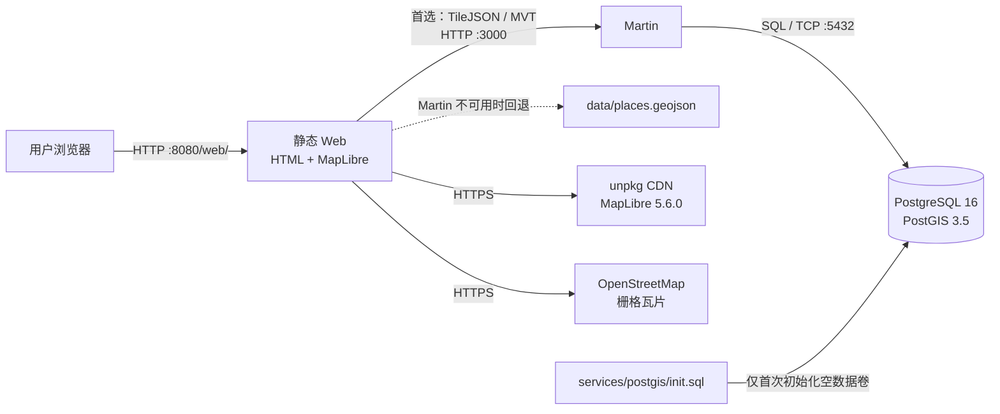

# 个人 GIS

面向江苏、安徽区域的本地优先个人地理信息系统 MVP。项目把个人点位数据与底图分离，当前已经具备静态 GeoJSON 浏览路径，并为 PostGIS + Martin 矢量瓦片路径准备了可运行配置。

> 文档基线：2026-08-01。文档严格区分当前实现与后续规划；空目录不代表对应能力已经完成。

GitHub：[bd4rex/personal-gis](https://github.com/bd4rex/personal-gis)（公开仓库）

本基线已完成干净数据卷实机验证：PostgreSQL 16.9 / PostGIS 3.5.2、Martin 1.11.0、唯一 `places_web` 发布源、TileJSON、MVT 和静态 HTTP 路径均通过。

## 当前状态

| 能力 | 状态 | 当前实现 |
|---|---|---|
| Web 地图浏览 | 已实现 | `web/index.html` + MapLibre GL JS 5.6.0 |
| 在线底图 | 已实现 | 浏览器直接读取 OpenStreetMap 标准栅格瓦片 |
| 静态个人点位 | 已实现 | `data/places.geojson`，含 2 个演示点 |
| 空间数据库 | 已配置、未启动 | PostgreSQL 16 + PostGIS 3.5，Docker Compose 管理 |
| 矢量瓦片服务 | 已配置、未启动 | Martin 1.11.0，仅发布白名单中的 PostGIS 空间视图 |
| Web 数据源回退 | 已实现 | Martin 不可用时自动回退到本地 GeoJSON |
| QGIS / QField 项目 | 规划中 | `qgis/` 为空，尚无 `.qgz` / `.gpkg` |
| 导入、导出与同步 | 规划中 | 目录已预留，尚无 ETL 或同步脚本 |
| 离线底图 | 规划中 | MBTiles / PMTiles 目录已预留，尚无数据或服务配置 |

## 架构总览



完整的组件关系、调用时序、数据模型和演进边界见[技术架构与组合逻辑](docs/architecture.md)。

## 快速启动

仅启动静态预览：

```powershell
.\scripts\start-web.ps1
```

然后访问 `http://localhost:8080/web/`。

当前检查到本机的 `8080` 已被另一套 `giss-web` 容器占用。释放端口前，可直接改用：

```powershell
.\scripts\start-web.ps1 -Port 8081
```

并访问 `http://localhost:8081/web/`。

启动 PostGIS 和 Martin：

```powershell
.\scripts\start-services.ps1
```

启动后，Web 页面优先尝试 `http://localhost:3000/places_web`；请求失败时自动使用 `data/places.geojson`。

## 文档导航

| 文档 | 内容 |
|---|---|
| [技术架构与组合逻辑](docs/architecture.md) | 系统边界、组件分层、依赖关系、启动与请求时序、数据流、数据模型、演进架构 |
| [资源与配置清单](docs/resource-configuration.md) | 镜像、容器、端口、网络、卷、环境变量、健康检查、数据库对象、前端参数、外部资源、容量与安全边界 |
| [运行与验证手册](docs/operations.md) | 启动、检查、验证、停止、备份、故障定位及当前端口冲突 |
| [本地技术栈摘要](docs/local-stack.md) | 最短的本地栈说明与入口 |
| [MVP 路线图](docs/local-mvp-plan.md) | 从文件型验证到 PostGIS、移动采集与同步的阶段规划 |

## 数据与隐私

本仓库为公开仓库，只应提交代码、配置、文档和脱敏演示数据。`.gitignore` 已排除会话记录、个人照片、导入数据、GeoPackage、GPX、MBTiles、PMTiles 和 OsmAnd 数据包。不要提交真实个人点位；新增数据前必须确认已经脱敏。

## 当前约束

- `services/docker-compose.yml` 中的 `gis/gis` 是本地开发默认凭据，不可用于公网或生产环境。
- Martin 已锁定为 1.11.0，但镜像尚未锁定 digest；最高复现要求下仍应记录镜像摘要。
- 未配置 CPU、内存、日志大小、TLS、鉴权、备份任务和监控；容器重启策略为 `unless-stopped`。
- 页面依赖互联网加载 MapLibre CDN 与 OSM 底图，因此还不是完整离线系统。
- `init.sql` 只在 PostGIS 数据卷首次创建时自动执行；修改 SQL 不会自动迁移已有数据库。
