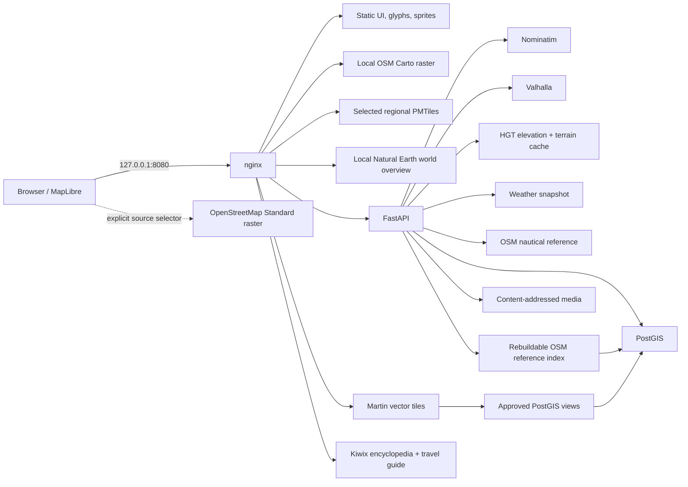

# Architecture

> English | [简体中文](ARCHITECTURE.zh-CN.md) · Snapshot `2026-08-03T23:12:23+08:00`

## Design goals

1. Work without internet after data and images are downloaded.
2. Keep personal places, tracks, notes, and media under local control.
3. Treat the Jiangsu/Anhui MVP as a repeatable regional cell for a future global system.
4. Keep components replaceable: renderer, base map, database, geocoder, and router are separate concerns.

## Runtime topology

Only nginx publishes a host port. The other services use Docker DNS and are not directly reachable from the LAN or host network.

## Data ownership boundaries

### Reference map

Files under `products/tiles/pmtiles/<province>.pmtiles` are derived, replaceable OpenStreetMap province snapshots through zoom 16. They can be rebuilt, added, or removed without touching personal records.

The schema-v3 catalog is expanded from two files. `web/config/region-catalog.json` defines the 34 province-level administrative units, source profiles, build estimates, and bounds. `web/config/map-catalog.json` retains rendering limits and a fallback region. MapLibre receives every installed PMTiles source and expands the same style definition across them. The default camera fits their combined bounds; per-region controls only focus the camera. Because installation units are independently clipped administrative regions, this gives continuous local coverage without requiring a combined replacement archive.

Each pack has a manifest containing source sequence/timestamp, member list, source/product SHA256, bounds, and tool provenance. FastAPI reads the products and metadata but does not receive arbitrary host-command capability. The browser submits only catalog IDs and fixed actions to an allowlisted host maintenance queue; the worker owns guarded build/update/remove scripts. The maintenance snapshot enriches running map jobs from their bounded log tail with a five-stage model (boundary, extract, merge, tile build, finalization), while queued jobs receive their actual worker queue position. Curl progress rows are normalized into byte throughput and received/total values; Planetiler archive rows are normalized into generated tile count, tiles per second, feature throughput, and staged bytes. The browser polls this lightweight snapshot and performs a full resource inventory again only after the active queue drains.

The resource inventory has two delivery paths. `GET /resources?cached=true` reads the last atomically persisted complete inventory, while `GET /resources` refreshes it. Directory usage for independent roots is collected through a bounded thread pool. The frontend displays the cache first, refreshes in the background, renders Available from the in-memory catalog, and renders maintenance tasks from `/maintenance` even when no inventory is ready.

### Resource management

`web/config/resource-catalog.json` provides the supported resource taxonomy. China points to 34 independent province datasets, while the generated `world-region-catalog.json` supplies the full Geofabrik continent/country/region hierarchy. Continents and the six Chinese geographic groups are presentation sections only; every downloadable row resolves to one physical pack and a concrete lifecycle command.

A province is independently installed only after its PMTiles and manifest both pass validation; otherwise it is available, staged, or partially installed. Jiangsu and Anhui are the validated independently installed provinces in this documentation snapshot.

`GET /api/resources` is the local inventory boundary. It combines disk capacity, filesystem usage, PostGIS size, regional pack state, shared search/route coverage, recovery-kit usage, and semantic update checks. With `check_upstream=true`, the API compares installed source sequence/timestamp metadata with trusted provider state files and caches the result. The browser presents that information as **Available**, **Local**, and **Updates** views. Jobs can be queued, cancelled, or retried, while heavy index rebuilds remain explicit and never enter the regular automatic batch.

The always-installed Natural Earth layers provide a zoomed-out offline world. Offline coverage is resolved at the center of the unobstructed map area, accounting for side/detail panels instead of trusting MapLibre's padding-shifted camera center. Package bounds are used as a fast mandatory prefilter before exact polygon boundaries, preventing a malformed or unrelated boundary from claiming a distant viewport. Outside installed PMTiles coverage, the smallest matching downloadable package is presented as an ownership choice with a localized name.

The map-source control separates the preferred provider from the source that is actually rendering. It offers offline-only, OpenStreetMap Standard raster, and OpenFreeMap vector modes; source load/error events drive loading, connected, fallback, and degraded states. Online layers remain above local base layers but below personal, weather, nautical, and terrain overlays. They are never used as package sources and are not bulk-cached.

### Personal source of truth

PostGIS contains:

- `app.places`: points, categories, notes, JSON tags, optimistic version number;
- `app.collections` and `app.place_collections`: user-owned many-to-many point organization;
- `app.tracks`: MultiLineString tracks and GPX metadata;
- `app.media`: image metadata and SHA256-addressed files;
- `app.change_log`: row-level change history;
- `app.places_web` and `app.tracks_web`: the only views published by Martin.

FastAPI is the write boundary. The browser does not receive database credentials and does not write SQL.

### Offline reference search

`app.reference_places` contains a derived index of named OSM nodes from `giss-core-latest.osm.pbf`, which merges every installed province source. `app.dataset_state` records its source timestamp, import time, row count, and source hash. These tables are replaceable products, not personal records, so an import truncates and atomically replaces the index.

`GET /api/search` merges personal places, personal tracks, lightweight reference matches, and normalized Nominatim address matches behind one stable API. Personal matches sort first. The lightweight table remains useful for fast nearby and emergency queries; Nominatim adds house numbers, structured addresses, ranking, and reverse lookup without becoming the personal source of truth.

### Routing, terrain, and encyclopedia

Valhalla and Nominatim consume `giss-core-latest.osm.pbf`, a manifest-tracked merge of all installed regional source PBFs from one China snapshot. They are optional Compose-profile services behind FastAPI adapters. The browser never depends on their native response formats or ports.

`POST /api/route` returns GeoJSON, a normalized summary, Chinese UI maneuver labels, and a sampled elevation profile for `auto`, `bicycle`, or `pedestrian`. A route is ephemeral until the user saves it, at which point it becomes an ordinary `app.tracks` record covered by personal backups.

Valhalla's local HGT files serve three roles: graph elevation, direct FastAPI sampling, and terrain rendering. FastAPI emits Terrarium PNG tiles through zoom 12 and caches them under `data/terrain-cache`. Coverage checks return and cache empty neighbor tiles without scanning every pixel, while per-tile locks prevent duplicate concurrent generation. MapLibre uses the same local tiles for hillshade, and the bundled `maplibre-contour` worker generates continuous vector contours with zoom-dependent 10-500 meter intervals and collision-aware elevation labels. Hillshade and contours remain independent optional layers, and no second global contour archive is required.

Kiwix serves exact Chinese Wikipedia and Wikivoyage ZIMs under `/wiki/`. nginx keeps them under the same localhost origin, while `--blockexternal` prevents article links from silently depending on the network. Natural Earth supplies the always-installed low-zoom overview, Open-Meteo snapshots provide refreshable weather, and the shared OSM PBF produces the local seamark/harbor layer.

### Media

Uploaded images are decoded and validated before storage. The file name is based on SHA256, while metadata and its place or track owner live in PostGIS. Duplicate metadata can share one physical object. Deleting an owning record removes its links and removes the physical object only after the final SHA256 reference disappears. GeoJSON, GPX, and a manifest-protected ZIP containing personal records and media provide engine-neutral exits.

## Database evolution

SQL files under `services/postgis/migrations/` are ordered and recorded in `public.app_schema_migrations`. `scripts/migrate-giss.ps1` applies each migration once with `ON_ERROR_STOP` enabled. Initialization is therefore reproducible on both empty and existing volumes.

## Map rendering

The default **OSM Original** source is rendered locally by the `osm-carto` service from its own imported OSM database and tile cache. Its build pipeline stages the source, resumes external-data preparation, validates the candidate renderer, and keeps the existing map available until the replacement is healthy.

The **Interactive Vector** source uses `web/src/map-style.js` to build an OSM-like MapLibre style from the local catalog. It includes landcover, land use, water, roads, rail, buildings, boundaries, labels, POIs, offline glyphs, and offline sprites. Two visual modes reuse the same data and layer IDs.

PMTiles contains vector features; MapLibre applies the local style at runtime. This keeps styling controllable and allows base features to remain clickable. Personal, route, terrain, weather, nautical, and emergency layers remain interactive above either local base-map source.

Online OpenStreetMap Standard and OpenFreeMap are explicitly selected temporary references. The local Natural Earth overview, OSM Carto renderer, and installed regional vector packages remain available when the network is absent.

Rendered vector features are queried directly in MapLibre when clicked. FastAPI then searches the nearby PostGIS reference index to enrich a tile feature with fuller OSM tags. Dense search and nearby results use client-side GeoJSON clustering through zoom 15. Saving never mutates OSM-derived tables; it creates an ordinary personal point, normally in the built-in Favorites collection.

The right detail panel is shared by base-map and personal objects. Base features expose local OSM details, nearby discovery, and collection. Personal points expose collections, notes, nearby track suggestions, media, editing, and deletion.

The route panel is a separate task surface with mode controls, start/end selection, summary, maneuver list, real elevation canvas, save, and clear actions. Terrain and emergency data remain ordinary layer toggles. The emergency layer is generated from the existing reference index inside current map bounds and grouped as medical, rescue, shelter, supplies, and fuel.

## Security posture

- Images are pinned by digest.
- Only `127.0.0.1:8080` is published.
- `.env` is ignored; `.env.example` contains no secret.
- nginx mounts only the web directory and PMTiles product directory.
- dotfiles are denied and internal Compose/database files are not web-accessible.
- Martin explicitly publishes only `places_web` and `tracks_web`.
- API uploads have a 64MB proxy limit and image decoding validation.

This is a single-user local application, not an authenticated internet service. Do not change the bind address to `0.0.0.0` without adding authentication, TLS, rate limits, and a stricter upload policy.

## Growth path

The regional cell scales in three independent directions:

- more base-map regions: additional independently verified catalog packs plus a low-zoom global overview;
- more personal capabilities: richer schemas, attachments, synchronization, and history UI;
- more engines or datasets: the current Nominatim, Valhalla, HGT, and Kiwix adapters can be replaced or expanded behind the same API/URL boundaries.

The personal database remains stable across all three changes.
