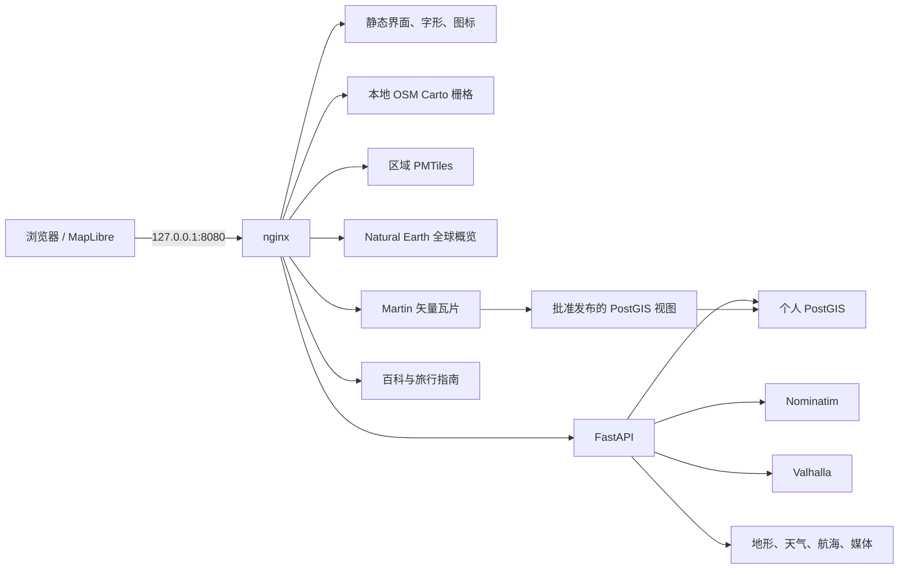

# 架构

> [English](ARCHITECTURE.md) | 简体中文 · 快照 `2026-08-04T02:45:00+08:00`

## 设计目标

1. 数据与镜像准备完成后可以长期断网运行。
2. 个人点位、轨迹、备注和媒体始终由本地用户控制。
3. 江苏/安徽的实验策略必须由目录和清单自动推广到后来安装的省份、国家和地区。
4. 渲染器、地图包、数据库、地理编码器和路线引擎保持可替换。
5. 派生地图与索引可以重建，个人资料必须稳定迁移和恢复。

## 运行拓扑

只有 nginx 发布宿主机端口。其他容器通过 Docker DNS 通信，不能从局域网直接访问。

## 数据所有权边界

### 参考地图

`products/tiles/pmtiles/<region>.pmtiles` 是可替换的 OpenStreetMap 派生产品。每个包都必须有清单，记录源序列、源时间、成员、边界、源文件与产品 SHA256、构建工具及时间。

`region-catalog.json` 定义中国 34 个省级单元；`world-region-catalog.json` 定义 550 多个 Geofabrik 国家或地区包；`map-catalog.json` 保存渲染约束。多个已安装 PMTiles 同时加载，区域快捷方式只改变镜头，不隐藏其他已安装包。

区域包只有在 PMTiles 与 manifest 同时通过校验后才算独立安装；否则处于可获取、暂存或部分安装状态。本快照中通过校验并已安装的是江苏、安徽和山东。

OSM Carto 是当前默认的熟悉地图视觉。它从全部已安装且启用的区域清单生成候选数据库，在每个区域渲染非空测试瓦片后才切换，并保留上一卷回滚。全球水域、冰盖和低缩放边界从校验过的本地归档复用。PMTiles 继续提供可交互的矢量地图、点击属性和独立区域生命周期。

### 资源管理

浏览器只能提交目录 ID 和固定动作。FastAPI 校验请求后写入白名单维护队列，宿主机工作器执行受保护脚本。任务状态从真实日志生成：下载显示接收字节与速度，Planetiler 显示瓦片数、瓦片速度、要素速度和暂存大小；无法测量的阶段只显示“处理中”。

资源盘点采用 stale-while-refresh：先返回最后一次完整快照，再由一个锁保护的后台线程刷新。维护状态单独获取，因此大型磁盘扫描不会隐藏正在运行的任务。

### 个人权威数据

PostGIS 保存：

- `app.places`：点位、分类、备注、标签、评分和乐观版本号；
- `app.collections`、`app.place_collections`：个人集合及成员关系；
- `app.tracks`：MultiLineString 轨迹与 GPX 元数据；
- `app.media`：媒体元数据、SHA256 与所有者；
- `app.change_log`：行级变更历史；
- `app.places_web`、`app.tracks_web`：Martin 唯一允许发布的视图。

浏览器没有数据库凭据，所有写操作都经过 FastAPI。

### 离线参考搜索

`app.reference_places` 是从共享能力 PBF 重建的命名 OSM 节点索引，`app.dataset_state` 记录来源时间、导入时间、数量和哈希。`/api/search` 合并个人点位、个人轨迹、轻量参考结果和 Nominatim 地址结果，个人结果优先。

参考索引和 Nominatim 都是可再生产品，不是个人权威数据。共享范围由全部已安装且启用的区域自动推导；本快照为江苏、安徽和山东。

### 路线、地形与知识库

Valhalla 与 Nominatim 使用同一份清单保护的共享 PBF。共享索引采用候选版本构建、验证后切换，并保留一个可回退版本。失败或取消不会替换活动版本。

天气、航海、OSM Carto、Nominatim、Valhalla 和轻量参考搜索都在清单中记录区域 ID 与源 SHA256。资源盘点逐区域比较这些输入；新增区域不会因服务整体健康而被误判为已覆盖。

HGT 文件同时用于 Valhalla 海拔、FastAPI 点/路线采样和 Terrarium 地形瓦片。`maplibre-contour` 在浏览器生成连续等高线。Kiwix 在同源 `/wiki/` 下提供中文维基百科和维基导游，并阻止静默访问外网。

### 媒体与可移植导出

上传图片先解码验证，再以 SHA256 命名。多个元数据记录可以共用一个物理文件；最后一个所有者删除后才清理文件。GeoJSON、GPX 和带 SHA256 清单的 ZIP 提供与数据库引擎无关的数据出口。

## 数据库演进

`services/postgis/migrations/` 中的 SQL 按顺序执行，并记录到 `public.app_schema_migrations`。`scripts/migrate-giss.ps1` 使用 `ON_ERROR_STOP`，保证新卷和已有卷都能重现同一结构。

## 地图渲染

- **OSM 原版：** 本地 OSM Carto 栅格，是默认浏览来源。
- **交互矢量：** MapLibre 在运行时为 PMTiles 应用本地样式，可点击要素并保存到个人集合。
- **全球概览：** Natural Earth 在低缩放和无区域包时始终可用。
- **在线参考：** OSM Standard 与 OpenFreeMap 只能由用户明确选择，只用于当前视口，不视为已拥有或批量缓存的数据。

个人点位、轨迹、天气、航海、应急、地形和等高线作为独立叠加层，保持与底图来源解耦。

## 安全边界

- 第三方镜像固定到 digest；Python 依赖固定版本。
- 只发布 `127.0.0.1:8080`。
- `.env` 不进入 Git，示例文件不含密钥。
- nginx 拒绝 dotfile，并只挂载所需目录。
- Martin 禁止自动发布全部表。
- 上传限制为 64MB，并执行图片解码验证。

这是单用户本地应用，不具备公网身份认证。加入认证、TLS、限流和更严格上传策略前，不得改成 `0.0.0.0`。

## 扩展方向

- 增加独立校验的区域包和共享索引范围；
- 增加个人数据类型、附件、同步和历史界面；
- 在稳定 API 后替换或扩展 Nominatim、Valhalla、Kiwix、地形及渲染引擎。

三个方向都不应改变个人 PostGIS 的权威地位。
