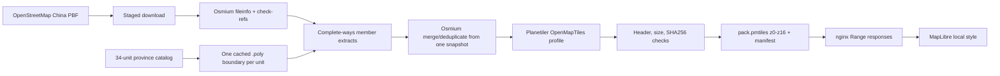
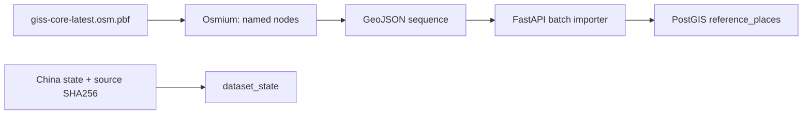
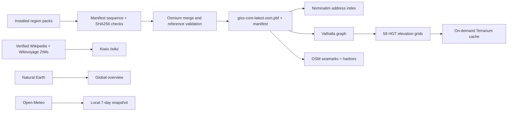
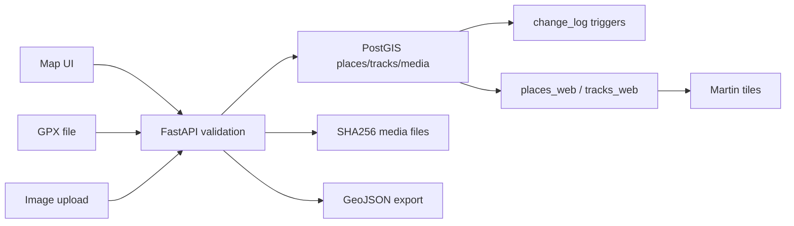

# Data Pipeline

> English | [简体中文](DATA_PIPELINE.zh-CN.md) · Snapshot `2026-08-03T23:12:23+08:00`

## Base-map flow



The same lifecycle also handles direct Geofabrik packs from `world-region-catalog.json`. Run `sync-world-catalog.cmd` to refresh the generated hierarchy, then use `region-pack.cmd Plan/Build/Update/Verify/Remove -PackId <id>` exactly as for a Chinese province. A direct global pack downloads its own provider PBF and does not require a local polygon cut.

## Why the China snapshot is authoritative

The project downloads province PBF files for comparison and provenance, but the production merge is not made by joining those two provider extracts. Independently produced regional extracts can contain duplicate object IDs with different versions along shared borders.

`build-region-pack.ps1` extracts one mainland province from the same `china-latest.osm.pbf`. Taiwan uses its Geofabrik direct-source profile. Every build produces exactly one province source and one province PMTiles archive.

## Download

Run:

```powershell
D:\GISS\download-osm.cmd
```

The script downloads:

- China, Jiangsu, and Anhui PBF files;
- matching replication state files;
- catalogued `.poly` boundaries for the supported Chinese administrative regions.

Jiangsu and Anhui are the validated installed packs in this documentation snapshot. A `.staged.pmtiles` file is a build candidate, not an installed pack, until validation succeeds and its active archive and manifest are atomically replaced.

Every PBF first lands in a staging file. Osmium reads its metadata and checks references before the file replaces the active copy. The previous China/province PBF is retained as `.previous` when replaced.

When a provider publishes an MD5 checksum, the staged file must match it. The shared China source currently has no adjacent checksum, so Osmium `fileinfo -e` and `check-refs` are mandatory before atomic activation. A failed download or validation never replaces the active snapshot.

Some regional provider extracts report missing external node references near cut boundaries. The build uses `complete_ways`, and Planetiler may log a small number of skipped ways when the upstream China extract itself lacks a node. Treat a large increase in these warnings as a data-quality regression.

## Build

List and verify installed packs:

```powershell
D:\GISS\region-pack.cmd List
D:\GISS\region-pack.cmd Verify
```

Resolve, build, update, verify, or remove one independent province:

```powershell
D:\GISS\region-pack.cmd Plan -PackId jiangsu
D:\GISS\region-pack.cmd Build -PackId jiangsu
D:\GISS\region-pack.cmd Update -PackId jiangsu
D:\GISS\region-pack.cmd Verify -PackId jiangsu
D:\GISS\region-pack.cmd Remove -PackId jiangsu -ConfirmRemove
```

`Build` uses the currently owned source snapshot. `Update` first refreshes the selected pack's trusted provider state and source, then builds from that refreshed snapshot. For mainland province packs that share `china-latest.osm.pbf`, the downloader checks the small remote replication state before fetching the large PBF. Once one queued province update has installed and validated the new China snapshot, subsequent province updates with the same sequence reuse it instead of downloading the same file again.

Inputs:

- `raw/osm/china/china-latest.osm.pbf`
- the selected pack's member polygons under `raw/osm/polygons`
- cached Planetiler supporting datasets under `raw/planetiler-sources`

Outputs:

- `raw/osm/china/provinces/<province>-latest.osm.pbf` (mainland) or the direct regional source;
- `products/tiles/pmtiles/<pack>.pmtiles`
- `products/tiles/pmtiles/<pack>.manifest.json`
- `products/tiles/pmtiles/<pack>.previous.pmtiles` after a successful replacement

Planetiler is pinned by digest, receives a 6GB Java heap, and uses the OpenMapTiles profile with catalog bounds and maximum zoom 16.

The generated archive must be larger than 10MB and begin with the seven-byte `PMTiles` signature. SHA256 is printed after replacement. A machine-readable manifest is written beside each archive with province identity, source timestamp/sequence, bounds, sizes, and hashes. The current active products are approximately 415.0 MiB for Jiangsu and 330.9 MiB for Anhui; their detail overlays are approximately 22.5 MiB and 9.7 MiB respectively.

The upstream China snapshot currently reports two missing way-node references. The generic build accepts an explicitly parsed count up to 100 and prints a warning; a larger count, an unrecognized check failure, a bad PMTiles header, or a hash/size mismatch stops replacement.

## Offline reference-search flow



Run after a successful regional map build:

```powershell
D:\GISS\import-reference-search.cmd
```

The importer currently stores named point features and classifies common OSM keys including `place`, `amenity`, `shop`, `tourism`, `historic`, `leisure`, `railway`, and public transport. The current snapshot produces 126,340 deduplicated reference places. Import uses a temporary staging table and replaces the derived index in one transaction, so personal tables are never touched.

This is intentionally smaller and simpler than Nominatim. It searches names and common aliases/brands but does not provide house-number interpolation, structured address parsing, or reverse geocoding.

## Shared advanced-capability flow



Run:

```powershell
D:\GISS\prepare-advanced.cmd
```

`build-capability-source.ps1` reads every installed physical pack, verifies each regional source hash against its PMTiles manifest, merges/deduplicates overlapping PBFs, records either one common sequence or a mixed-source sequence set, and atomically writes the shared PBF plus manifest. Compatibility-bundle inputs are expanded to province IDs when the API reports search/route coverage.

Valhalla builds 847 graph tiles into a roughly 620 MiB tar archive and downloads only the 58 one-degree HGT grids touched by the graph. FastAPI decodes Valhalla's polyline6 response into GeoJSON, normalizes maneuvers, samples the local HGT files for the profile, and lets the result be saved as an ordinary personal track.

Nominatim imports the same shared PBF into its own persistent PostgreSQL volume. `/api/search` appends normalized address matches after personal/reference results; `/api/geocode` and `/api/reverse` expose the full address boundary. The index is derived data: normal updates rebuild it, while disconnected kits also carry a stopped-volume consistency snapshot for fast restoration.

MapLibre requests `/api/terrain/{z}/{x}/{y}.png` only when hillshade is enabled. FastAPI samples local HGT values into Terrarium encoding and caches only tiles containing real elevation data. The cache can be removed without losing source elevation.

The knowledge downloaders resume into staging files, check exact SHA256, and atomically install their ZIMs. The current Chinese Wikipedia all-mini snapshot is `2026-05`, and the Chinese Wikivoyage all-maxi snapshot is `2026-06`; their manifests live under `products/encyclopedia`.

`sync-overview-resources.cmd` installs and hashes the Natural Earth raster/country/place assets. `sync-weather.cmd` refreshes seven-day snapshots for 29 Jiangsu/Anhui cities. `build-nautical.cmd` extracts seamarks, harbors, lighthouses, beacons, breakwaters, and marinas from the capability PBF. These are ordinary local products exposed through stable FastAPI or static-asset routes.

## Personal-data flow



GPX parsing uses `defusedxml`. Invalid geometry, malformed coordinates, unsupported files, and invalid images are rejected before persistence. Image bytes are decoded with Pillow before they are stored.

## Browser assets

Run:

```powershell
D:\GISS\download-web-assets.cmd
```

This refreshes pinned browser libraries, local glyphs, the local sprite sheet, and the asset manifest. Once downloaded, normal map browsing does not require external CDN access.

## Update cadence

For map packs, a monthly or quarterly manual refresh is safer than an always-on replication daemon. Weather uses a six-hour freshness threshold, the global catalog a weekly threshold, and nautical data is marked stale whenever the shared capability PBF hash changes. Each map update should follow:

1. Create a personal-data backup.
2. Fetch the trusted provider state; stop as current when its sequence already matches the installed manifest.
3. Download changed source data to staging and validate, or reuse an already validated shared snapshot at the same sequence.
4. Build to staging and validate.
5. Rebuild the reference-search index.
6. Verify every installed pack, then run health and browser smoke tests.
7. Keep the previous PMTiles until the new map has been used successfully.

Minute replication is a later global-scale concern. It requires diff sequencing, failure recovery, state monitoring, and reproducible regional extraction.
