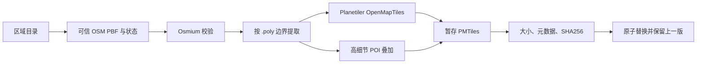
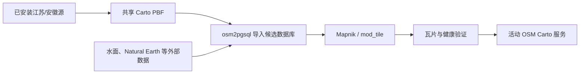
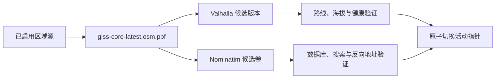
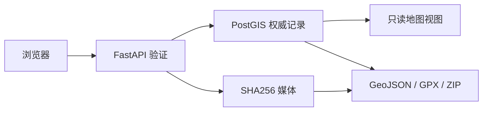

# 数据流水线

> [English](DATA_PIPELINE.md) | 简体中文 · 快照 `2026-08-03T23:12:23+08:00`

## 区域底图流程

### 为什么中国快照是权威来源

大陆省份从同一个带状态文件的中国快照提取，避免把不同提供方的省级 PBF 直接拼接后在边界出现相同 OSM ID 的不同对象版本。台湾使用独立的 Geofabrik 来源配置。

下载写入暂存文件，验证格式、来源状态和校验值后才替换当前源。`.previous` 文件在新产品通过浏览器验收前保留。

### 构建规则

`scripts/build-region-pack.ps1` 使用固定 Planetiler 镜像和 6GB Java 堆生成至 z16 的 OpenMapTiles PMTiles。`scripts/build-region-details.ps1` 使用项目内 YAML 构建高细节兴趣点叠加。最终 manifest 记录输入、产品、边界、时间、工具和哈希。

每个省、国家或地区是独立安装单元。地理分组只用于导航，不生成组合包。更新会先刷新可信上游状态；源序列未变化时禁止重复“更新”，需要重新生成时使用“重建”。

本快照中通过校验并已激活的独立区域包是江苏和安徽：主 PMTiles 分别约 415.0 MiB 和 330.9 MiB，高细节叠加分别约 22.5 MiB 和 9.7 MiB。仅有 `.staged.pmtiles` 的构建候选不算已安装；必须通过校验并原子替换活动归档与 manifest 后才进入本地资源清单。

## 本地 OSM Carto 流程

`build-osm-carto.ps1` 可以续建中断的外部数据和数据库后处理。活动地图在候选渲染器健康前继续服务。数据库放在外部 Docker 卷，瓦片缓存位于 `data/osm-carto-tiles`，二者都纳入恢复包规则。

## 轻量离线参考搜索

共享能力 PBF 通过 Osmium 导出命名节点，FastAPI 导入器规范化名称、类别、坐标和 OSM 标签。导入在事务中替换 `app.reference_places`，并在 `app.dataset_state` 写入来源时间、数量和 SHA256。

该索引用于快速统一搜索、附近发现、应急设施和矢量要素补充。它不接受个人编辑；保存参考地点会新建普通个人点位。

## 共享高级能力

共享能力源只包含当前启用范围。候选版本按顺序构建以控制 16 GiB 主机内存；活动搜索和路线在构建期间继续工作。验收成功后更新 `.env` 指针并保留一个历史版本；失败或取消不改变活动版本。

HGT 数据用于路线海拔、点查询、Terrarium 地形和浏览器等高线。百科与旅行指南下载支持续传，校验精确 SHA256 后原子安装。天气和全球目录按短周期刷新；大型地图、索引和知识库只允许显式任务。

## 个人数据流程

点位和轨迹编辑使用乐观版本号防止覆盖较新的修改。媒体在解码后写入，所有权删除会清理最后一个引用。每日备份包含数据库 dump、媒体和校验清单；完整离线包另外保存派生产品、Docker 镜像和高级数据库快照。

## 浏览器资源

MapLibre、PMTiles、Lucide、字形和 sprites 下载到本地并记录来源与版本。正常离线运行不依赖 CDN。Natural Earth 提供全球概览；在线 OSM/OpenFreeMap 只在用户明确选择时访问当前视口。

## 更新周期

| 资源 | 默认策略 |
| --- | --- |
| 天气 | 每 6 小时自动检查/刷新 |
| 全球目录 | 每 7 天自动同步 |
| 区域地图 | 手动检查、更新或重建 |
| Nominatim/Valhalla | 区域范围变化后手动候选重建 |
| 百科/旅行指南 | 手动下载大文件 |
| 完整 OSM 快照 | 生产灾备基线；增量链路仅隔离研究 |

所有生产替换都遵循“暂存、验证、激活、保留回退”的顺序。
