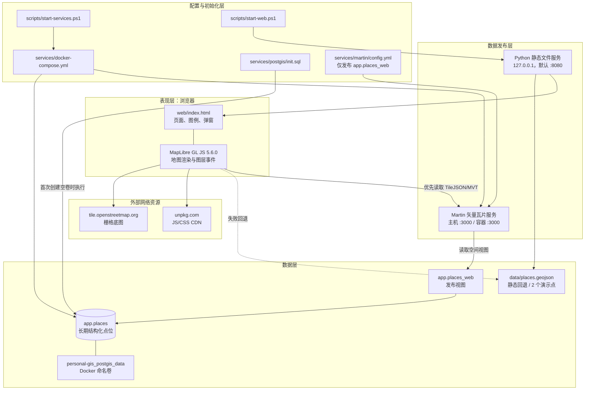
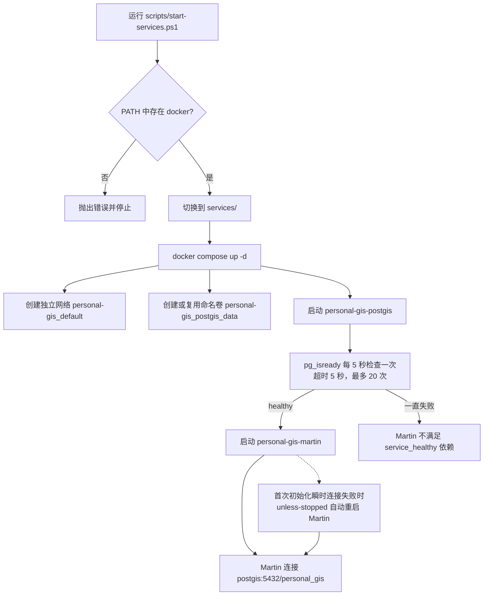
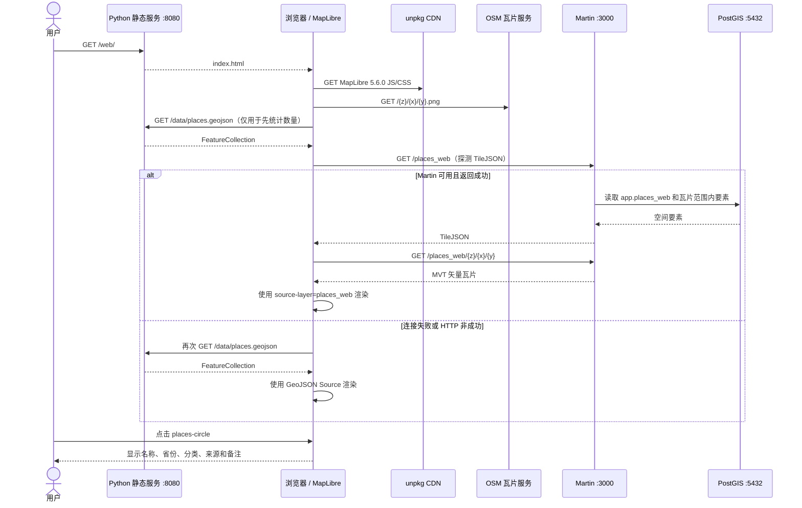
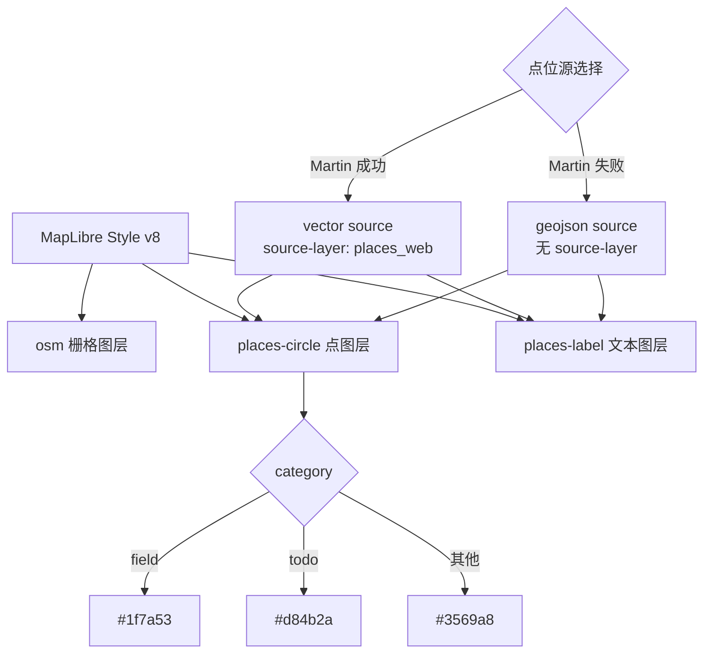
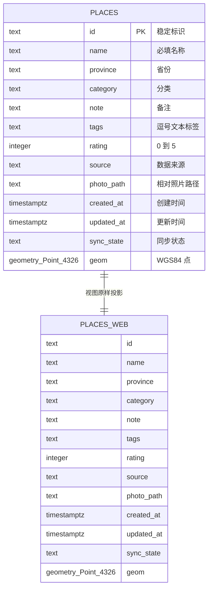
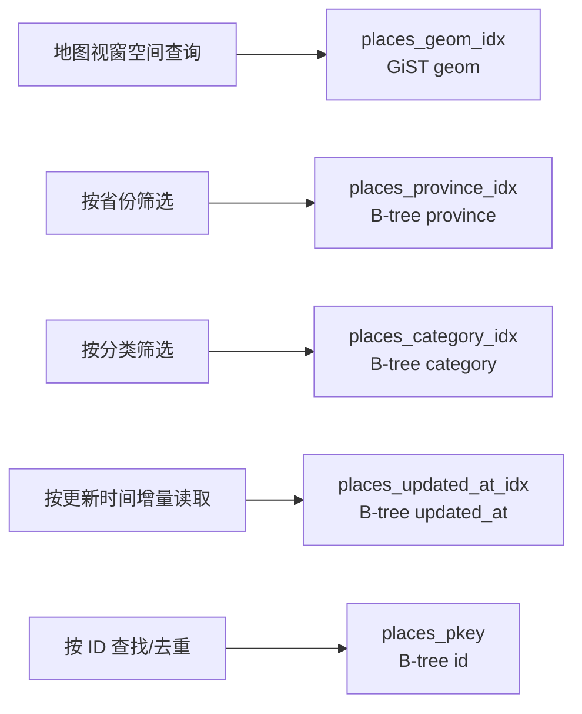
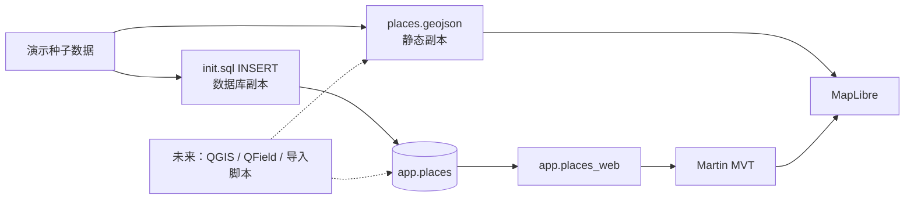
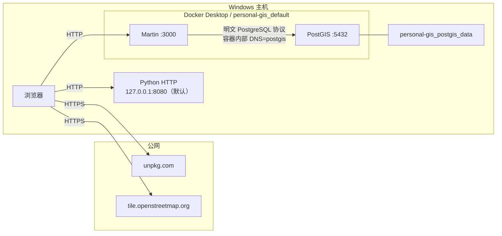
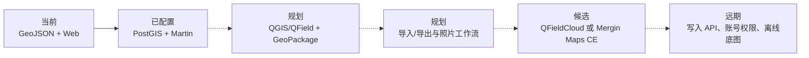

# 技术架构与组合逻辑

本文是当前项目的架构事实源，描述代码库在 2026-08-01 的实际状态。路线图中的候选组件只有在代码或配置已经存在时才视为当前系统组成。

## 1. 系统目标与边界

当前 MVP 解决四件事：

1. 在浏览器中查看江苏、安徽范围内的个人点位。
2. 在后端服务不可用时，仍可通过静态 GeoJSON 完成最小演示。
3. 在 Docker 可用时，以 PostGIS 保存结构化点位，并由 Martin 转换为浏览器可消费的矢量瓦片。
4. 为后续 QGIS/QField 采集、导入、照片、离线底图和同步服务保留目录及数据模型扩展点。

当前系统不包含用户认证、写入 API、移动端同步服务、QGIS 项目、GeoPackage 主库、离线底图服务或生产级运维设施。

## 2. 分层架构



### 分层职责

| 层 | 职责 | 不负责 |
|---|---|---|
| 表现层 | 地图初始化、图层样式、点位计数、弹窗和交互 | 数据写入、鉴权、复杂查询 |
| 数据发布层 | 静态文件分发；把 PostGIS 空间表/视图发布为 TileJSON 与 MVT | 业务校验、数据同步 |
| 数据层 | 点位结构、空间索引、属性索引、持久化 | 底图、照片二进制内容 |
| 配置与初始化层 | 创建容器、数据库对象和种子数据 | 已有数据库的增量迁移 |
| 外部资源层 | 提供前端运行库和在线底图 | 个人点位持久化 |

## 3. 当前组件清单与完成度

| 组件 | 技术/文件 | 状态 | 上游依赖 | 下游消费者 |
|---|---|---|---|---|
| Web Shell | `web/index.html` | 已实现 | Python HTTP 服务、浏览器 | 最终用户 |
| 地图引擎 | MapLibre GL JS 5.6.0 | 已实现、远程加载 | unpkg CDN、WebGL | Web Shell |
| 在线底图 | OSM 标准栅格瓦片 | 已实现、远程加载 | 公网、OSM 服务 | MapLibre |
| 静态点位 | `data/places.geojson` | 已实现 | 静态 HTTP 服务 | MapLibre 回退路径 |
| PostGIS | `postgis/postgis:16-3.5` | 已配置、当前未运行 | Docker Desktop、命名卷 | Martin、未来 QGIS/API |
| Martin | `ghcr.io/maplibre/martin:1.11.0` + `services/martin/config.yml` | 已配置、当前未运行 | 健康的 PostGIS | MapLibre 主路径 |
| 数据初始化 | `services/postgis/init.sql` | 已实现 | 首次创建空 PostGIS 卷 | `app.places` / `app.places_web` |
| 服务启动 | `scripts/start-services.ps1` | 已实现 | PowerShell、Docker | Docker Compose |
| Web 启动 | `scripts/start-web.ps1` | 已实现 | PowerShell、Python | 仅绑定本机的静态 HTTP 服务；端口可覆盖 |
| QGIS/QField | `qgis/` | 仅预留 | 尚未配置 | 未来桌面/移动编辑 |
| 导入区 | `data/imports/` | 仅预留 | 尚无导入脚本 | 未来 ETL |
| 照片区 | `data/photos/` | 仅预留 | 尚无附件流程 | 未来 QField/Web |
| 离线底图 | `data/basemaps/` | 仅预留 | 尚无瓦片文件和服务 | 未来桌面/移动/Web |

## 4. 组合逻辑

### 4.1 启动依赖



Compose 只管理 PostGIS 和 Martin。Web 静态服务不在 Compose 内，必须单独运行 `start-web.ps1` 或等价的 HTTP 服务。

PostGIS 镜像首次初始化时会先启动临时数据库、执行初始化脚本，再切换到正式数据库进程；简单的 `pg_isready` 可能在这个切换窗口前短暂成功。干净卷实测中 Martin 因瞬时连接失败重启 5 次，随后自动恢复并达到 healthy，因此 `restart: unless-stopped` 是当前首次启动可靠性的一部分。

### 4.2 浏览器请求与回退时序



关键行为：

- 页面无论后端是否可用，都会先请求一次 GeoJSON 计算点位数量。
- `fetch("http://localhost:3000/places_web")` 成功才切换至矢量瓦片源。
- 任一 Martin 探测异常都会进入 `catch`，随后再次读取 GeoJSON，因此回退情况下 GeoJSON 会请求两次。
- 数据源切换只发生在页面加载阶段；Martin 后续中断不会自动热切换到 GeoJSON，需刷新页面。
- Martin 连接成功时，计数仍来自 GeoJSON，不是数据库的实时数量，所以状态面板可能与数据库实际点数不一致。

### 4.3 前端图层组合



图层顺序为底图、点、标签；标签位于点图层上方。点半径为 8 px，白色描边 2 px。标签字号为 13 px，在点位下方偏移显示。

## 5. 数据模型

### 5.1 逻辑模型



`app.places_web` 不是独立存储对象，只是从 `app.places` 选择全部当前字段的普通视图。Martin 配置关闭 `auto_publish`，通过显式表白名单只把该视图生成成 `places_web` TileJSON/MVT 数据源；底层表和 PostGIS 自带 schema 不对 Web 发布。

### 5.2 标识、坐标与约束

| 规则 | 当前实现 |
|---|---|
| 主键 | `id text PRIMARY KEY`；由上游生成，数据库不自动生成 UUID |
| 坐标顺序 | 经度、纬度，即 `[x, y]` |
| 坐标参考系 | EPSG:4326 / WGS 84 |
| 几何类型 | 二维 `Point`，非空 |
| 评分范围 | `0 <= rating <= 5` |
| 默认分类 | `todo` |
| 默认来源 | `manual` |
| 默认同步状态 | `local` |
| 时间 | 数据库默认 `now()`，类型为 `timestamptz` |
| 更新时间维护 | 只有默认值，没有 trigger；更新记录时需由调用方显式修改 `updated_at` |
| 标签结构 | 普通文本，不是数组或 JSON；当前演示值用逗号分隔 |
| 照片 | 数据库只保存路径，不保存二进制文件，也没有外键/存在性校验 |

### 5.3 索引与访问路径



当前数据模型只包含点位。路线图中的 `visits`、`collections`、`tracks`、`attachments` 和 `place_versions` 尚未建表，不能视为现有能力。

## 6. 数据生命周期



目前 GeoJSON 和 SQL 种子数据是两份手工维护的副本，没有自动同步机制。修改其中一份不会更新另一份。若两边数据不同：

- Martin 可用时，地图要素来自数据库，但面板计数仍来自 GeoJSON。
- Martin 不可用时，地图与计数均来自 GeoJSON。
- `ON CONFLICT (id) DO NOTHING` 只避免首次初始化脚本内的重复主键；不会将变更合并到已有行。

## 7. 目录与模块责任

```text
个人GIS/
├─ README.md                         项目入口、状态与文档导航
├─ .gitignore                       发布边界，排除隐私数据与大文件
├─ data/
│  ├─ places.geojson                可提交的脱敏演示点位
│  ├─ imports/{osmand,gpx,geojson}/ 预留的本地导入区（不提交）
│  ├─ photos/                        预留的个人照片区（不提交）
│  └─ basemaps/{mbtiles,pmtiles}/    预留的离线底图区（不提交）
├─ docs/
│  ├─ architecture.md               本文：架构与组合逻辑
│  ├─ resource-configuration.md      资源和配置事实清单
│  ├─ operations.md                  运行、验证、备份与排障
│  ├─ local-stack.md                 本地栈摘要
│  └─ local-mvp-plan.md              阶段路线图
├─ qgis/                             预留；当前为空
├─ scripts/
│  ├─ start-services.ps1             启动 Docker 服务
│  └─ start-web.ps1                  启动 Python 静态服务
├─ services/
│  ├─ docker-compose.yml             PostGIS/Martin 编排
│  ├─ postgis/init.sql               数据库首次初始化
│  └─ martin/config.yml              Martin 源白名单与监听/CORS 配置
└─ web/
   ├─ index.html                     完整单页地图实现
   └─ src/                            预留；当前为空
```

`gao/` 是会话工作记录，不属于系统架构，已通过 `.gitignore` 排除，不应发布到 GitHub。

## 8. 网络与信任边界



三个端口当前都映射或绑定到主机，而不是只在 Docker 内网开放。配置未提供 TLS、反向代理、鉴权或防火墙规则，因此仅适合受信任的本机开发环境。

## 9. 现状与目标架构的边界



虚线阶段均为规划，不代表已安装、已配置或已验证。当前最重要的架构缺口是没有唯一写入主数据源：GeoJSON 与 PostGIS 种子并存，却没有同步或迁移流程。

## 10. 已识别的技术风险

| 优先级 | 风险 | 影响 | 建议 |
|---|---|---|---|
| 高 | Compose 明文使用 `gis/gis` 凭据，且数据库端口暴露到主机 | 误用于共享网络时会造成未授权访问 | 使用 `.env`/secret 注入强密码，限制绑定地址 |
| 高 | 弹窗通过 `setHTML` 直接拼接数据属性 | 导入不可信点位时可能形成 HTML/XSS 注入 | 转义属性或使用 DOM `textContent` 构造弹窗 |
| 高 | 个人数据目录若误提交会泄露位置与照片 | 隐私泄漏不可逆 | 保留 `.gitignore`，发布前检查 `git status` 与仓库可见性 |
| 中 | 镜像只锁定版本标签，未锁定 digest | 上游重推标签时仍可能漂移 | 在稳定部署基线中记录并锁定 digest |
| 中 | PostGIS 首次初始化期间健康状态可能短暂成功后断连 | Martin 第一次连接可能失败 | 保留 Martin `unless-stopped`，未来可用更稳定的就绪检查 |
| 中 | `init.sql` 不是迁移系统 | 已有卷不会获得后续表结构变更 | 引入版本化迁移工具或显式迁移脚本 |
| 中 | GeoJSON 与数据库双份数据无同步 | 点位和计数不一致 | 确立 PostGIS 或 GeoPackage 为唯一事实源并自动导出 |
| 中 | 外部 CDN/OSM 是运行时强依赖 | 断网时页面脚本或底图不可用 | 本地托管 MapLibre，配置离线瓦片 |
| 中 | 没有资源限制、日志轮转、备份和监控 | 长时间运行的稳定性不可控 | 在进入长期运行阶段前补齐运维配置 |
| 低 | Web 默认端口 8080 可能冲突 | 默认命令无法启动 | 使用脚本 `-Port` 参数显式选择空闲端口 |

## 11. 架构决策摘要

| 决策 | 原因 | 代价 |
|---|---|---|
| 底图与个人数据分离 | 可替换底图供应商，个人数据仍自主保存 | 浏览器同时依赖多个数据源 |
| 静态 GeoJSON 作为回退 | 后端未启动也能演示 | 双份数据一致性需要管理 |
| PostGIS 作为长期内核 | 空间查询、索引和结构化扩展能力强 | 需要容器、备份和迁移运维 |
| Martin 直接发布空间视图 | 省去首期自写瓦片 API | 业务鉴权和复杂逻辑能力有限 |
| 单页无构建前端 | 零 npm 构建步骤，启动简单 | 所有逻辑集中、CDN 依赖、测试与模块化不足 |
| EPSG:4326 统一存储 | 与 GPS/GeoJSON 输入直接兼容 | 某些距离/面积计算需投影或使用 geography |
| Compose 项目名固定为 `personal-gis` | 避免与同样位于 `services/` 目录的其他 Compose 项目串组 | 同一主机不能再用同项目名部署第二套环境，除非显式覆盖项目名 |

## 12. 外部技术依据

- [Martin PostgreSQL Table Sources](https://maplibre.org/martin/sources-pg-tables/)：空间表/视图自动发布与 TileJSON 行为。
- [MapLibre GL JS 文档](https://maplibre.org/maplibre-gl-js/docs)：浏览器地图引擎和数据源模型。
- [MapLibre Style Spec - Sources](https://maplibre.org/maplibre-style-spec/sources/)：vector source 的 TileJSON URL 语义。
- [Docker Compose 启动顺序](https://docs.docker.com/compose/how-tos/startup-order/)：`service_healthy` 依赖行为。
- [PostGIS 手册](https://postgis.net/docs/postgis-en.html)：空间类型、SRID 与空间函数。
