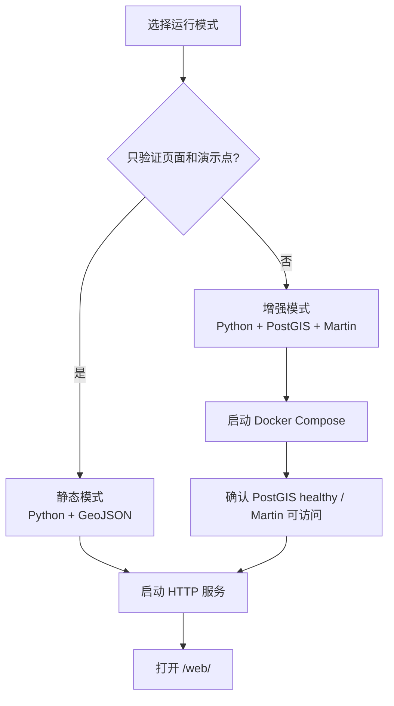

# 运行与验证手册

本文给出当前 MVP 的可重复运行步骤。所有命令均从项目根目录 `C:\Users\Administrator\Documents\个人GIS` 执行，除非命令旁另有说明。

## 1. 启动模式



## 2. 静态模式

### 2.1 默认端口

```powershell
.\scripts\start-web.ps1
```

访问：

```text
http://localhost:8080/web/
```

该脚本在前台运行，按 `Ctrl+C` 停止。默认只绑定 `127.0.0.1`，并将整个项目根目录作为 HTTP 根目录，页面才能通过 `../data/places.geojson` 读取数据。端口已被占用时，脚本会在启动前给出明确错误。

### 2.2 当前机器的 8080 冲突

2026-08-01 检查时，`8080` 已由另一项目的 `giss-web` 容器占用。可选择释放该项目的端口，或在本项目根目录临时启动其他端口：

```powershell
.\scripts\start-web.ps1 -Port 8081
```

访问：

```text
http://localhost:8081/web/
```

不要只双击打开 `web/index.html`；`file://` 环境下的 Fetch 和跨源行为可能使 GeoJSON 无法正常读取。

## 3. PostGIS + Martin 增强模式

### 3.1 启动

```powershell
.\scripts\start-services.ps1
```

脚本实际执行：

```powershell
Set-Location .\services
docker compose up -d
```

全新数据库卷首次启动时，Martin 可能在 PostGIS 临时初始化进程切换为正式进程的窗口内连接失败。当前 `restart: unless-stopped` 会自动重试；实测重启 5 次后恢复 healthy。若 PostGIS 已 healthy 而 Martin 仍处于 restarting，先等待约一分钟再检查日志。

### 3.2 检查容器

```powershell
docker compose -f .\services\docker-compose.yml ps
```

预期容器：

| 容器 | 预期状态 | 端口 |
|---|---|---|
| `personal-gis-postgis` | `running (healthy)` | `5432:5432` |
| `personal-gis-martin` | `running` | `3000:3000` |

### 3.3 检查日志

```powershell
docker compose -f .\services\docker-compose.yml logs --tail 100 postgis
docker compose -f .\services\docker-compose.yml logs --tail 100 martin
```

### 3.4 检查数据库对象

不要求主机安装 `psql`，可使用容器内客户端：

```powershell
docker exec personal-gis-postgis psql -U gis -d personal_gis -c "SELECT PostGIS_Version();"
docker exec personal-gis-postgis psql -U gis -d personal_gis -c "SELECT id, name, category, ST_AsText(geom) FROM app.places ORDER BY id;"
docker exec personal-gis-postgis psql -U gis -d personal_gis -c "SELECT indexname, indexdef FROM pg_indexes WHERE schemaname = 'app' ORDER BY indexname;"
```

预期 `app.places` 至少包含两个演示点；如果卷曾被修改，实际数量可能不同。

### 3.5 检查 Martin

```powershell
Invoke-RestMethod http://localhost:3000/places_web
```

预期返回 TileJSON，其中包含 `tiles` 和 `vector_layers`。若源 ID 与预期不同，先列出 Martin catalog：

```powershell
Invoke-RestMethod http://localhost:3000/catalog
```

### 3.6 启动 Web

保持 Docker 服务运行，再启动静态 Web。若 8080 被占用，使用 8081：

```powershell
.\scripts\start-web.ps1 -Port 8081
```

打开 `http://localhost:8081/web/`。页面左上角数据源应显示：

```text
PostGIS -> Martin -> MapLibre
```

若显示 `data/places.geojson`，说明 Martin 探测请求失败并进入了回退路径。

## 4. 验证清单

| 检查 | 命令/操作 | 通过标准 |
|---|---|---|
| Compose 语法 | `docker compose -f .\services\docker-compose.yml config -q` | 退出码为 0 |
| PostGIS 健康 | `docker inspect personal-gis-postgis --format '{{.State.Health.Status}}'` | 输出 `healthy` |
| 数据库对象 | 查询 `app.places`、`app.places_web` | 表/视图存在，查询无错 |
| Martin catalog | 请求 `/catalog` | 只有 `places_web` 空间源 |
| TileJSON | 请求 `/places_web` | HTTP 2xx，含 `vector_layers` |
| 静态页面 | 请求 `/web/` | HTTP 200，标题正确 |
| GeoJSON | 请求 `/data/places.geojson` | HTTP 200，`features` 数组存在 |
| 地图范围 | 浏览器观察 | 初始视野在江苏、安徽，无法拖出最大范围 |
| 分类样式 | 浏览器观察 | `todo` 红色、`field` 绿色 |
| 弹窗 | 点击点位 | 显示名称、元数据和备注 |
| 回退 | 停止 Martin 后刷新 | 数据源显示 GeoJSON，两个演示点仍可见 |

## 5. 停止服务

停止容器但保留数据库卷：

```powershell
docker compose -f .\services\docker-compose.yml down
```

不要随意添加 `-v`。`down -v` 会删除 `personal-gis_postgis_data`，其中的数据库数据将丢失，除非已有备份。

静态 Web 服务在其 PowerShell 窗口按 `Ctrl+C` 停止。

## 6. 备份与恢复

### 6.1 逻辑备份

先创建一个不纳入 Git 的本地备份目录，再输出 PostgreSQL 自定义格式备份：

```powershell
New-Item -ItemType Directory -Force .\backups | Out-Null
docker exec personal-gis-postgis pg_dump -U gis -d personal_gis -Fc -f /tmp/personal_gis.dump
docker cp personal-gis-postgis:/tmp/personal_gis.dump .\backups\personal_gis.dump
```

`backups/` 应只保存在受控位置；如果备份包含真实位置，建议加密并避免提交 Git。

### 6.2 恢复前注意

恢复会改写数据库状态。执行恢复前应确认目标数据库、备份时间和现有数据是否需要保留。初始化 SQL 不能替代真实数据备份。

## 7. 常见故障

### 7.1 `Only one usage of each socket address...` 或端口被占用

检查端口：

```powershell
Get-NetTCPConnection -State Listen | Where-Object LocalPort -in 3000,5432,8080
```

处理方式：停止明确属于自己的冲突服务，或修改本项目端口。不要在未确认所属进程时强制结束进程。

### 7.2 页面打开但没有地图

依次检查：

1. 浏览器开发者工具是否显示 MapLibre CDN 加载失败；
2. 当前网络是否可访问 `unpkg.com`；
3. 浏览器是否支持 WebGL；
4. 页面是否通过 HTTP 服务访问，而不是 `file://`。

### 7.3 有底图但没有点

检查：

```powershell
Invoke-RestMethod http://localhost:8081/data/places.geojson
Invoke-RestMethod http://localhost:3000/places_web
```

若使用 Martin，再确认 TileJSON 中 `vector_layers[].id` 是否为 `places_web`，因为前端把 `source-layer` 固定为该值。

### 7.4 Martin 启动失败

常见检查顺序：

1. `personal-gis-postgis` 是否为 `healthy`；
2. `docker compose ... logs postgis` 是否显示初始化 SQL 错误；
3. `docker compose ... logs martin` 是否显示连接或源发现错误；
4. 数据库中是否存在 `app.places_web` 且 geometry SRID 为 4326；
5. 端口 3000 是否被其他进程占用。

### 7.5 修改 `init.sql` 后数据库没有变化

这是预期行为。Docker PostGIS 初始化目录只在数据目录为空时执行。对已有卷，应编写并显式执行迁移 SQL；不要为了应用 DDL 变更直接删除卷，除非已经确认数据可丢弃或已备份。

### 7.6 数据源状态与点位数量不一致

当前状态面板的数量来自 GeoJSON，即使地图正在显示 Martin/PostGIS 数据。出现不一致不一定是服务故障，而是当前实现的双数据源计数逻辑。

## 8. 发布前检查

GitHub 提交前至少执行：

```powershell
git status -sb
git diff --check
docker compose -f .\services\docker-compose.yml config -q
```

并人工确认：

- 没有 `gao/`、照片、导入文件、离线底图、数据库转储或真实轨迹进入暂存区；
- `data/places.geojson` 仍然只有脱敏演示数据；
- 没有 `.env`、令牌或真实数据库密码；
- 文档中的“当前实现”和“规划中”边界仍与代码一致。
